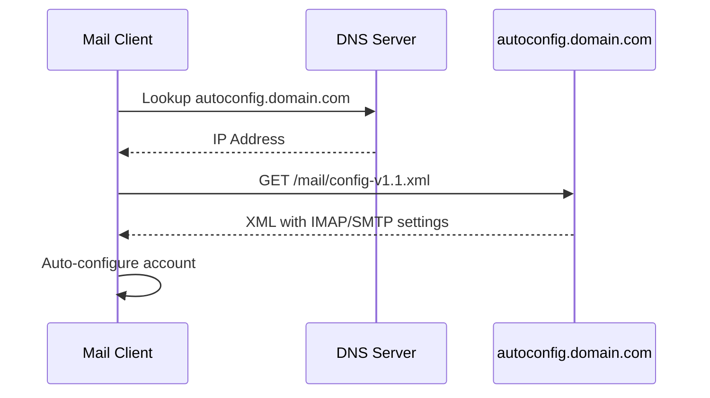

# Ansible Role: Mail Autoconfig

Provides automatic mail client configuration for Thunderbird and other mail clients that support the Mozilla Autoconfig standard.

## Overview

This role sets up a web endpoint that serves `config-v1.1.xml` for automatic mail client configuration. When users configure their email client, it can automatically discover IMAP/SMTP settings without manual configuration.



## Requirements

- Debian 12/13 or Ubuntu 24.04
- nginx_mono role for vhost configuration
- DNS record pointing `autoconfig.<domain>` to the server

## Role Variables

See `defaults/main.yml` for all available variables.

### Key Variables

```yaml
# Mail domain (required)
mail_autoconfig_domain: example.com

# Provider ID for the XML
mail_autoconfig_provider_id: example.com

# IMAP configuration
mail_autoconfig_imap:
  hostname: mail.example.com
  port: 993
  socket_type: SSL
  authentication: password-cleartext
  username: '%EMAILADDRESS%'

# SMTP configuration
mail_autoconfig_smtp:
  hostname: mail.example.com
  port: 465
  socket_type: SSL
  authentication: password-cleartext
  username: '%EMAILADDRESS%'

# SSL/TLS (optional)
mail_autoconfig_vhost_letsencrypt: true
```

### Optional Features

#### Multiple Domains

```yaml
mail_autoconfig_domains:
  - example.com
  - example.org
  - example.net
```

#### POP3 Support

```yaml
mail_autoconfig_pop3:
  enabled: true
  hostname: mail.example.com
  port: 995
  socket_type: SSL
  authentication: password-cleartext
  username: '%EMAILADDRESS%'
```

#### CalDAV (Calendar) and CardDAV (Contacts)

Useful when running Radicale or similar CalDAV/CardDAV servers:

```yaml
mail_autoconfig_caldav:
  enabled: true
  hostname: calendar.example.com
  port: 443
  socket_type: SSL
  authentication: password-cleartext
  username: '%EMAILADDRESS%'
  path: '/radicale/%EMAILADDRESS%/calendar/'

mail_autoconfig_carddav:
  enabled: true
  hostname: contacts.example.com
  port: 443
  socket_type: SSL
  authentication: password-cleartext
  username: '%EMAILADDRESS%'
  path: '/radicale/%EMAILADDRESS%/contacts/'
```

#### WebMail Link

```yaml
mail_autoconfig_webmail:
  enabled: true
  url: "https://webmail.example.com/"
```

### Authentication Types

| Type | Description |
|------|-------------|
| `password-cleartext` | Password sent in cleartext (use only with SSL/TLS!) |
| `password-encrypted` | Password encrypted with CRAM-MD5 or similar |
| `OAuth2` | OAuth 2.0 authentication |
| `NTLM` | NTLM authentication (Microsoft) |
| `GSSAPI` | Kerberos/GSSAPI authentication |

### Socket Types

| Type | IMAP Port | SMTP Port | POP3 Port | Description |
|------|-----------|-----------|-----------|-------------|
| `SSL` | 993 | 465 | 995 | Implicit TLS (recommended) |
| `STARTTLS` | 143 | 587 | 110 | Upgrade to TLS after connect |
| `plain` | 143 | 25 | 110 | No encryption (not recommended!) |

### Username Placeholders

| Placeholder | Description | Example |
|-------------|-------------|---------|
| `%EMAILADDRESS%` | Full email address | `user@example.com` |
| `%EMAILLOCALPART%` | Local part before @ | user |
| `%EMAILDOMAIN%` | Domain part after @ | example.com |

## Dependencies

- alphanodes.setup.common
- alphanodes.setup.ssl
- alphanodes.setup.nginx_mono

## Example Playbook

### Basic Configuration

```yaml
- hosts: mailserver
  roles:
    - role: alphanodes.setup.mail_autoconfig
      vars:
        mail_autoconfig_domain: example.com
        mail_autoconfig_vhost_letsencrypt: true
```

### Full Configuration with CalDAV/CardDAV

```yaml
- hosts: mailserver
  roles:
    - role: alphanodes.setup.mail_autoconfig
      vars:
        mail_autoconfig_domain: example.com
        mail_autoconfig_vhost_letsencrypt: true
        mail_autoconfig_imap:
          hostname: mail.example.com
          port: 993
          socket_type: SSL
          authentication: password-cleartext
          username: '%EMAILADDRESS%'
        mail_autoconfig_smtp:
          hostname: mail.example.com
          port: 465
          socket_type: SSL
          authentication: password-cleartext
          username: '%EMAILADDRESS%'
        mail_autoconfig_caldav:
          enabled: true
          hostname: radicale.example.com
          port: 443
          socket_type: SSL
          authentication: password-cleartext
          username: '%EMAILADDRESS%'
          path: '/%EMAILADDRESS%/calendar/'
        mail_autoconfig_carddav:
          enabled: true
          hostname: radicale.example.com
          port: 443
          socket_type: SSL
          authentication: password-cleartext
          username: '%EMAILADDRESS%'
          path: '/%EMAILADDRESS%/contacts/'
        mail_autoconfig_webmail:
          enabled: true
          url: "https://webmail.example.com/"
```

## DNS Configuration

Create a DNS A/AAAA record for your autoconfig subdomain:

```text
autoconfig.example.com.  IN  A     192.0.2.1
autoconfig.example.com.  IN  AAAA  2001:db8::1
```

## Testing

After deployment, test the configuration:

```bash
curl https://autoconfig.example.com/mail/config-v1.1.xml
```

Expected output should be valid XML with your mail server settings.

## References

- [Mozilla Autoconfig Specification](https://wiki.mozilla.org/Thunderbird:Autoconfiguration:ConfigFileFormat)
- [Thunderbird Autoconfiguration](https://www.thunderbird.net/en-US/thunderbird/autoconfiguration/)

## License

MIT
