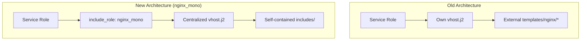

# nginx to nginx_mono Migration Guide

This document tracks learnings, requirements, and migration status for
transitioning service roles from the old `nginx` role architecture to
`nginx_mono`.

## Architecture Overview

### Old Architecture (nginx role)

- Each service role had its own `templates/vhost.j2` template
- Templates included shared nginx includes via external paths:
  ``
- This required playbook-level template directories
- Not compatible with Ansible Collections (which cannot access external templates)

### New Architecture (nginx_mono)

- Single centralized `vhost.j2` template with modular includes
- All includes are self-contained within `roles/nginx_mono/templates/includes/`
- Service roles use `include_role` to integrate nginx_mono
- Configuration passed via `nginx_mono_service_config` variable



## Migration Checklist for Service Roles

### Required Changes

1. **Remove nginx dependency from meta/main.yml**:

   ```yaml
   # OLD (remove this):
   dependencies:
     - role: alphanodes.setup.nginx

   # NEW (keep only common):
   dependencies:
     - role: alphanodes.setup.common
       public: true
   ```

2. **Update tasks/nginx.yml to use include_role**:

   ```yaml
   - name: Setup nginx_mono and configure [service] vhost
     tags: nginx
     ansible.builtin.include_role:
       name: alphanodes.setup.nginx_mono
     vars:
       nginx_mono_service_name: [service_name]
       nginx_mono_service_enabled: true
       nginx_mono_service_config:
         server_name: "{{ [service]_vhost_server }}"
         root: "{{ [service]_path }}"
         # ... other configuration
   ```

3. **Delete old vhost template**: Remove `templates/vhost.j2` after migration

4. **Create Molecule tests**: Test the service + nginx_mono integration

5. **Create GitHub workflow**: Add CI/CD testing for the migrated service

## Learnings and Best Practices

### Global vs Per-Vhost Configuration

**Critical Learning (2024-11)**: When nginx_mono is called multiple times on the
same host with different variable values, global configuration files must be
handled carefully.

#### The Problem

On hosts where nginx_mono is called multiple times (e.g., standalone + via
service roles like zabbix_server), variable overrides in `include_role` can
cause idempotence issues:

```yaml
# First call: nginx_with_protection defaults to true
- role: alphanodes.setup.nginx_mono

# Second call: zabbix_server overrides to false
- ansible.builtin.include_role:
    name: alphanodes.setup.nginx_mono
  vars:
    nginx_with_protection: false  # Zabbix API needs Python access
```

**Old behavior (buggy)**:

1. First call: `protection.conf` created
2. Second call: `protection.conf` deleted (because `nginx_with_protection: false`)
3. Result: Directory timestamp changes every run → not idempotent

**New behavior (fixed)**:

- `protection.conf` is ALWAYS installed (no condition)
- The maps (`$bad_bot`, `$bad_locations`, etc.) are harmless if not used
- Per-vhost usage is controlled by `nginx_with_protection` in vhost template

#### Design Principle

| Config Type | Location | Managed By | Behavior |
| ----------- | -------- | ---------- | -------- |
| **Global maps** | `/etc/nginx/conf.d/protection.conf` | Always installed | Passive - no effect unless vhost uses them |
| **Global SSL** | `/etc/nginx/conf.d/ssl.conf` | First caller only | Uses `_nginx_mono_setup_done` fact |
| **Per-vhost protection** | In vhost template | Each service | Controlled by `nginx_with_protection` variable |

#### The `_nginx_mono_setup_done` Fact

For configuration that should only be managed on the first nginx_mono call
(like SSL settings), we use a fact to track completion:

```yaml
# At end of setup.yml
- name: Mark nginx_mono setup as complete
  ansible.builtin.set_fact:
    _nginx_mono_setup_done: true
  when: _nginx_mono_setup_done is not defined
```

This ensures that subsequent `include_role` calls from service roles don't
override host-level SSL configuration.

### HTTP to HTTPS Redirect

**Important Discovery**: In the old architecture, HTTP to HTTPS redirects were
handled differently depending on the role:

1. **Most roles had hardcoded redirect blocks** in their own `vhost.j2`:

   ```nginx
   # Example from old roundcube vhost.j2
   server {
     listen 80;
     listen [::]:80;
     server_name {{ roundcube_vhost_server }};
     return 301 https://{{ roundcube_vhost_server }}$request_uri;
   }
   ```

2. **The shared `port_redirect.inc.j2`** was only used for custom ports and
   had a different purpose (and was actually buggy for SSL custom ports).

3. **The condition `nginx_with_ssl and instance.server_port is defined`**
   in old templates meant the shared redirect was only included when a
   custom port was explicitly set - NOT for standard port 443.

**nginx_mono Solution**: Since nginx_mono uses ONE centralized vhost template,
it MUST automatically generate the HTTP to HTTPS redirect for all SSL vhosts:

- Standard SSL (port 443): `return 301 https://$host$request_uri;`
- Custom SSL ports (e.g., 8443): `return 301 https://$host:8443$request_uri;`
- Controlled by `nginx_listen_config.use_ssl` (always true for SSL vhosts)

### WebSocket Support

- Set `nginx_with_websocket: true` only for services that need it
- Example: ethercalc
- Creates `$connection_upgrade` variable and proper proxy headers

### Custom SSL Ports

- Supported via `server_port` in service config
- Ports > 1024 are treated as SSL ports (security assumption)
- HTTP/3 QUIC only available on standard port 443

### Instance vs Single Service Pattern

- **Type 1 (Single vhost)**: ethercalc, grafana - one service per server
- **Type 2 (Multiple vhosts)**: redmine, drupal - can manage multiple instances

### Location Order is Critical (2025-12)

**Critical Learning**: When migrating `locations` from old vhost templates to
`nginx_mono_service_config.locations`, the **order of locations matters**!

#### Why Order Matters

In nginx, regex locations (`~` and `~*`) are evaluated in the order they appear
in the config file. The **first match wins**. If a deny location comes before
a static files location, assets can be blocked.

**Example - Matomo Assets Blocked:**

```nginx
# WRONG ORDER (assets blocked):
location ~ ^/(libs|vendor|plugins|misc|node_modules) {
  deny all;
  return 403;
}

location ~ \.(gif|ico|jpg|png|svg|js|css|...)$ {
  allow all;
  expires 1h;
}
```

Request for `/plugins/Morpheus/images/logo.png`:

1. First regex `~ ^/(libs|vendor|plugins|...)` matches → **403 Forbidden**
2. Static files regex never reached!

**Correct order:**

```nginx
# CORRECT ORDER (assets served):
location ~ \.(gif|ico|jpg|png|svg|js|css|...)$ {
  allow all;
  expires 1h;
}

location ~ ^/(libs|vendor|plugins|misc|node_modules) {
  deny all;
  return 403;
}
```

#### Migration Rule

When migrating locations from old vhost templates:

1. **Copy the exact order** from the working old template
2. **Static file locations** must come BEFORE directory deny locations
3. **Test with actual assets** after migration (icons, images, CSS, JS)
4. **Compare generated config** with old working config side-by-side

#### Reference Order for PHP Applications

Based on working Matomo configuration:

```yaml
locations:
  # 1. PHP-FPM whitelist (specific PHP files)
  - name: "~ ^/(index|app)\\.php$"
    with_fpm: true
  # 2. Deny all other PHP
  - name: "~* ^.+\\.php$"
    actions: ["deny all", "return 403"]
  # 3. Main location (try_files)
  - name: "/"
    raw_actions: ["try_files $uri $uri/ =404;"]
  # 4. Deny sensitive directories (WITHOUT asset directories!)
  - name: "~ ^/(config|tmp|core|lang)"
    actions: ["deny all", "return 403"]
  # 5. Special file handling (no-cache, etc.)
  - name: "~ special_preview\\.js$"
    raw_actions: ["expires off;"]
  # 6. Static files - MUST come before libs/vendor/plugins!
  - name: "~ \\.(gif|ico|jpg|png|svg|js|css|...)$"
    raw_actions: ["allow all;", "expires 1h;"]
  # 7. Deny libs/vendor/plugins - AFTER static files!
  - name: "~ ^/(libs|vendor|plugins|misc|node_modules)"
    actions: ["deny all", "return 403"]
  # 8. Text files
  - name: "~/(.*\\.md|LICENSE)"
    raw_actions: ["default_type text/plain;"]
```

### Variable Shadowing in Multi-Instance Roles (2025-12)

**Critical Learning**: When migrating roles that use `loop` with instances (like
Jekyll, Redmine, Drupal), be careful with the `loop_var` name!

#### The Shadowing Problem

nginx_mono templates use `instance` as the variable name for configuration:

```jinja2

  server_name {{ instance.server_name }};

```

If a service role uses `loop_var: instance` for its own instance loop, the
service's instance variable **shadows** nginx_mono's `nginx_mono_instance`:

```yaml
# Jekyll role - WRONG (causes variable shadowing):
- name: Include instance tasks
  ansible.builtin.include_tasks: instance.yml
  loop: "{{ jekyll_instances }}"
  loop_control:
    loop_var: instance  # This shadows nginx_mono's 'instance'!
```

**Symptoms:**

- vhost template missing `root`, `index`, `locations`
- nginx config has server_name from Jekyll instance but nothing else
- Confusing because SOME values work (those passed directly)

#### The Solution

Use a **unique loop_var name** for each service role:

```yaml
# Jekyll role - CORRECT:
- name: Include instance tasks
  ansible.builtin.include_tasks: instance.yml
  loop: "{{ jekyll_instances }}"
  loop_control:
    loop_var: jekyll_instance  # Unique name, no shadowing
```

Then update all references in the instance tasks:

```yaml
# In instance.yml:
nginx_mono_service_config:
  server_name: "{{ jekyll_instance.server_name }}"
  locations: "{{ jekyll_instance.locations | default(jekyll_default_locations) }}"
```

#### Multi-Instance Migration Rule

When migrating multi-instance roles:

1. **Rename `loop_var`** to `[role]_instance` (e.g., `jekyll_instance`, `redmine_instance`)
2. **Update all references** in the instance tasks file
3. **Test with multiple instances** to verify no shadowing

### Use raw_actions Instead of New Variables (2025-12)

**Design Principle**: Before adding new variables to nginx_mono, check if the
functionality can be achieved with existing `locations` + `raw_actions`.

#### Example: static_try_files

Initially, we added `static_try_files` as a new nginx_mono variable:

```yaml
# WRONG - unnecessary new variable:
nginx_mono_service_config:
  static_try_files: "$uri $uri.html $uri/ =404"
```

This created a `location /` block in the template. But the same result can be
achieved with existing functionality:

```yaml
# CORRECT - use existing locations with raw_actions:
jekyll_default_locations:
  - name: "^~ /assets/"
    raw_actions:
      - "log_not_found off;"
      - 'add_header Cache-Control "public";'
      - "expires max;"
  - name: "/"
    raw_actions:
      - "try_files $uri $uri.html $uri/ =404;"
```

#### When to Add New Variables

Only add new nginx_mono variables when:

1. **Complex conditional logic** is needed (like `static_cache` with configurable expires)
2. **Server-level directives** that can't be in locations (like `protection.inc.j2`)
3. **Common patterns** used by many roles with configurable defaults

Don't add new variables for:

- Simple one-liner directives → use `raw_actions`
- Location blocks without complex logic → use `locations`
- Role-specific configuration → keep in role's defaults

## Migration Status

### Completed Migrations

| Role | Date | Notes |
| ---- | ---- | ----- |
| ethercalc | 2024-10 | First migration, WebSocket support tested |
| roundcube | 2024-11 | PHP-FPM pattern |
| dendrite | 2024-11 | Matrix server |
| element_web | 2024-11 | Static files |
| hedgedoc | 2024-11 | Collaborative editor |
| grafana | 2024-11 | Monitoring |
| loki | 2024-11 | Log aggregation |
| jekyll | 2025-12 | Static site generator, multi-instance pattern, raw_actions for try_files |
| mailpit | 2024-11 | Mail testing |
| sphinx | 2025-12 | Dependency-only pattern, no own vhosts (configured externally via nginx_vhosts) |
| matomo | 2025-11 | Analytics, FPM whitelist pattern, comprehensive security tests |
| nextcloud | 2024-11 | Cloud storage |
| radicale | 2024-11 | CalDAV/CardDAV |

### Pending Migrations

| Role | Complexity | Key Challenges |
| ---- | ---------- | -------------- |
| **redmine** | HIGH | Multiple instances (`redmine_instances`), complex vhost with many locations, custom proxy settings, socket paths |
| drupal | MEDIUM | Multiple instances pattern, FPM configuration |
| gitlab | MEDIUM | Complex reverse proxy, WebSocket for action cable |
| zabbix_web | LOW | PHP-FPM pattern |
| typo3 | MEDIUM | PHP-FPM with special rewrites |

## Complex Role Analysis

### redmine (Highest Complexity)

**Key Challenges:**

1. **Multiple Instances**: Uses `redmine_instances` list, each with own vhost
2. **Complex Locations**: Puma socket, assets, plugins, uploads
3. **Proxy Settings**: Custom proxy headers for ActionCable WebSocket
4. **SSL Variations**: Some instances may use custom ports (e.g., ATU customer with 8443)

**Current vhost template features to support:**

- `location ~* ^/(assets|images|javascripts|stylesheets|plugin_assets)/`
- Puma socket proxy configuration
- Custom `proxy_pass` for ActionCable WebSocket

**Migration Strategy:**

1. Ensure nginx_mono supports all location patterns
2. Handle instance-based configuration properly
3. Test with custom SSL ports

### drupal

**Key Challenges:**

1. Multiple instances similar to Redmine
2. Complex PHP-FPM location configuration
3. Drupal-specific rewrite rules

### gitlab

**Key Challenges:**

1. Complex reverse proxy configuration
2. ActionCable WebSocket support
3. Multiple backend services (workhorse, API, etc.)

## nginx_mono Feature Requirements

Based on migration analysis, nginx_mono must support:

### Core Features (Implemented)

- [x] Standard SSL (port 443)
- [x] Custom SSL ports (e.g., 8443)
- [x] HTTP to HTTPS redirect
- [x] WebSocket proxying
- [x] PHP-FPM integration
- [x] **FPM Whitelist Pattern** - Per-location FPM (`location.with_fpm: true`)
- [x] Static file serving
- [x] Basic auth protection
- [x] Custom locations
- [x] Proxy configuration
- [x] Security headers
- [x] Error pages
- [x] **Hidden files blocking** - Returns 404 (security best practice)

### Features to Implement/Verify

- [ ] Multiple vhost instances from same role (for Redmine)
- [ ] Complex rewrite rules
- [ ] Upstream blocks for multiple backends
- [ ] Puma socket proxy configuration

## Testing Requirements

Every migrated role MUST have:

1. **Molecule test scenario**: `molecule/[service]/`
2. **GitHub Actions workflow**: `.github/workflows/[service].yml`
3. **Workflow must include**: `roles/nginx_mono/**` in path triggers

### Idempotence Testing

nginx_mono has a dedicated idempotence test scenario that verifies correct
behavior when the role is called multiple times with different variable values:

```bash
# Run the idempotence test
MOLECULE_DISTRO=debian12 molecule test -s nginx_mono_idempotence
```

**What it tests:**

- 5 sequential nginx_mono calls with varying `nginx_with_protection` values
- Mix of service mode and instance mode (nginx_vhosts)
- Verifies `protection.conf` exists after all calls
- Checks idempotence (second run has `changed=0`)

**Test scenario structure:**

```text
molecule/nginx_mono_idempotence/
├── molecule.yml      # Docker test configuration
├── converge.yml      # 5 nginx_mono calls with different configs
└── verify.yml        # Assertions for idempotence
```

This test should be run after any changes to `setup.yml` or global
configuration handling in nginx_mono

## nginx_vhosts (Instance Mode)

nginx_mono supports two modes of operation:

### Service Mode (include_role)

Used by service roles like ethercalc, roundcube, etc.:

```yaml
- name: Setup nginx_mono
  ansible.builtin.include_role:
    name: alphanodes.setup.nginx_mono
  vars:
    nginx_mono_service_name: myservice
    nginx_mono_service_config:
      server_name: "example.com"
      # ...
```

### Instance Mode (nginx_vhosts)

Used for standalone vhosts like `_parking` or direct nginx configuration:

```yaml
- role: alphanodes.setup.nginx_mono
  vars:
    nginx_vhosts:
      - name: parking
        vhost_default: true
        root: /srv/parking
        index: index.html
      - name: static_site
        server_name: static.example.com
        root: /srv/static
        vhost_users:
          - user: admin
            password: secret
```

### Key Differences

| Feature | Service Mode | Instance Mode |
| ------- | ------------ | ------------- |
| Variable for instance | `nginx_mono_instance` | `instance` (from loop) |
| htpasswd path | `.htpasswd_{{ nginx_mono_service_name }}` | `.htpasswd_{{ instance.name }}` |
| Template comment | `# nginx {{ nginx_mono_service_name }}` | `# nginx {{ instance.name }}` |
| Triggered by | `nginx_mono_service_name` defined | `nginx_vhosts` list |

### Variable Scope Issue (Fixed 2024-11)

**Problem**: When nginx_mono is called multiple times (e.g., first in service mode,
then in instance mode), the `nginx_mono_instance` variable from the first call
persisted and was incorrectly used in subsequent instance mode calls.

**Solution**: `calculate_listen_config.yml` now explicitly checks if `instance`
is defined and prefers it over `nginx_mono_instance`:

```yaml
vars:
  _calc_source: "{{ instance if instance is defined else nginx_mono_instance | default({}) }}"
```

## Troubleshooting

### Common Issues

1. **No HTTP redirect**: Check `nginx_listen_config.use_ssl` is true
2. **Wrong SSL port**: Verify `server_port` in service config
3. **WebSocket not working**: Ensure `nginx_with_websocket: true` and `proxy_websocket: true`
4. **Template not found**: All includes must be in `roles/nginx_mono/templates/includes/`
5. **`nginx_mono_service_name` undefined**: When using instance mode (nginx_vhosts),
   templates use `instance.name` as fallback - ensure the variable scope fix is applied
6. **No `listen` directive generated**: Check that `nginx_with_ssl` matches the expected
   port. Without SSL, default port is 80; with SSL, default is 443.
7. **`vhost_default` not applied**: Ensure the variable scope fix in
   `calculate_listen_config.yml` is present - older versions had a bug where
   `nginx_mono_instance` from a previous role call would override `instance`

### Idempotence Issues

1. **Directory timestamp changes on every run**: Check if `protection.conf` or
   `ssl.conf` is being created/deleted repeatedly. This typically happens when:
   - A service role overrides `nginx_with_protection` or `nginx_with_ssl` in
     its `include_role` vars
   - The role is called multiple times with conflicting variable values
   - **Fix**: Global configs should not depend on service-specific variable
     overrides. See "Global vs Per-Vhost Configuration" section above.

2. **Config file deleted unexpectedly**: If a global config file disappears after
   a service role runs, check if that role is setting `nginx_with_*: false` in
   its include_role vars. The fix ensures `protection.conf` is always installed.

3. **SSL config changes on second role call**: SSL configuration is only managed
   on the first nginx_mono call (tracked by `_nginx_mono_setup_done` fact).
   Subsequent service roles should not affect global SSL settings.
