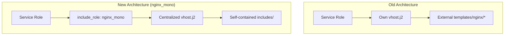

# nginx to nginx_mono Migration Guide

This document tracks learnings, requirements, and migration status for
transitioning service roles from the old `nginx` role architecture to
`nginx_mono`.

## Architecture Overview

### Old Architecture (nginx role)

- Each service role had its own `templates/vhost.j2` template
- Templates included shared nginx includes via external paths:
  ``
- This required playbook-level template directories
- Not compatible with Ansible Collections (which cannot access external templates)

### New Architecture (nginx_mono)

- Single centralized `vhost.j2` template with modular includes
- All includes are self-contained within `roles/nginx_mono/templates/includes/`
- Service roles use `include_role` to integrate nginx_mono
- Configuration passed via `nginx_mono_service_config` variable



## Migration Checklist for Service Roles

### Required Changes

1. **Remove nginx dependency from meta/main.yml**:

   ```yaml
   # OLD (remove this):
   dependencies:
     - role: alphanodes.setup.nginx

   # NEW (keep only common):
   dependencies:
     - role: alphanodes.setup.common
       public: true
   ```

2. **Update tasks/nginx.yml to use include_role**:

   ```yaml
   - name: Setup nginx_mono and configure [service] vhost
     tags: nginx
     ansible.builtin.include_role:
       name: alphanodes.setup.nginx_mono
     vars:
       nginx_mono_service_name: [service_name]
       nginx_mono_service_enabled: true
       nginx_mono_service_config:
         server_name: "{{ [service]_vhost_server }}"
         root: "{{ [service]_path }}"
         # ... other configuration
   ```

3. **Delete old vhost template**: Remove `templates/vhost.j2` after migration

4. **Create Molecule tests**: Test the service + nginx_mono integration

5. **Create GitHub workflow**: Add CI/CD testing for the migrated service

## Learnings and Best Practices

### HTTP to HTTPS Redirect

**Important Discovery**: In the old architecture, HTTP to HTTPS redirects were
handled differently depending on the role:

1. **Most roles had hardcoded redirect blocks** in their own `vhost.j2`:

   ```nginx
   # Example from old roundcube vhost.j2
   server {
     listen 80;
     listen [::]:80;
     server_name {{ roundcube_vhost_server }};
     return 301 https://{{ roundcube_vhost_server }}$request_uri;
   }
   ```

2. **The shared `port_redirect.inc.j2`** was only used for custom ports and
   had a different purpose (and was actually buggy for SSL custom ports).

3. **The condition `nginx_with_ssl and instance.server_port is defined`**
   in old templates meant the shared redirect was only included when a
   custom port was explicitly set - NOT for standard port 443.

**nginx_mono Solution**: Since nginx_mono uses ONE centralized vhost template,
it MUST automatically generate the HTTP to HTTPS redirect for all SSL vhosts:

- Standard SSL (port 443): `return 301 https://$host$request_uri;`
- Custom SSL ports (e.g., 8443): `return 301 https://$host:8443$request_uri;`
- Controlled by `nginx_listen_config.use_ssl` (always true for SSL vhosts)

### WebSocket Support

- Set `nginx_with_websocket: true` only for services that need it
- Examples: ethercalc, rocketchat
- Creates `$connection_upgrade` variable and proper proxy headers

### Custom SSL Ports

- Supported via `server_port` in service config
- Ports > 1024 are treated as SSL ports (security assumption)
- HTTP/3 QUIC only available on standard port 443

### Instance vs Single Service Pattern

- **Type 1 (Single vhost)**: ethercalc, rocketchat - one service per server
- **Type 2 (Multiple vhosts)**: redmine, drupal - can manage multiple instances

## Migration Status

### Completed Migrations

| Role | Date | Notes |
|------|------|-------|
| ethercalc | 2024-10 | First migration, WebSocket support tested |
| rocketchat | 2024-10 | WebSocket support |
| roundcube | 2024-11 | PHP-FPM pattern |
| dendrite | 2024-11 | Matrix server |
| element_web | 2024-11 | Static files |
| hedgedoc | 2024-11 | Collaborative editor |
| grafana | 2024-11 | Monitoring |
| loki | 2024-11 | Log aggregation |
| jekyll | 2024-11 | Static site generator |
| mailpit | 2024-11 | Mail testing |
| matomo | 2024-11 | Analytics |
| nextcloud | 2024-11 | Cloud storage |
| radicale | 2024-11 | CalDAV/CardDAV |

### Pending Migrations

| Role | Complexity | Key Challenges |
|------|------------|----------------|
| **redmine** | HIGH | Multiple instances (`redmine_instances`), complex vhost with many locations, custom proxy settings, socket paths |
| drupal | MEDIUM | Multiple instances pattern, FPM configuration |
| phpmyadmin | LOW | Simple PHP-FPM pattern |
| gitlab | MEDIUM | Complex reverse proxy, WebSocket for action cable |
| zabbix_web | LOW | PHP-FPM pattern |
| typo3 | MEDIUM | PHP-FPM with special rewrites |

## Complex Role Analysis

### redmine (Highest Complexity)

**Key Challenges:**

1. **Multiple Instances**: Uses `redmine_instances` list, each with own vhost
2. **Complex Locations**: Puma socket, assets, plugins, uploads
3. **Proxy Settings**: Custom proxy headers for ActionCable WebSocket
4. **SSL Variations**: Some instances may use custom ports (e.g., ATU customer with 8443)

**Current vhost template features to support:**

- `location ~* ^/(assets|images|javascripts|stylesheets|plugin_assets)/`
- Puma socket proxy configuration
- Custom `proxy_pass` for ActionCable WebSocket

**Migration Strategy:**

1. Ensure nginx_mono supports all location patterns
2. Handle instance-based configuration properly
3. Test with custom SSL ports

### drupal

**Key Challenges:**

1. Multiple instances similar to Redmine
2. Complex PHP-FPM location configuration
3. Drupal-specific rewrite rules

### gitlab

**Key Challenges:**

1. Complex reverse proxy configuration
2. ActionCable WebSocket support
3. Multiple backend services (workhorse, API, etc.)

## nginx_mono Feature Requirements

Based on migration analysis, nginx_mono must support:

### Core Features (Implemented)

- [x] Standard SSL (port 443)
- [x] Custom SSL ports (e.g., 8443)
- [x] HTTP to HTTPS redirect
- [x] WebSocket proxying
- [x] PHP-FPM integration
- [x] Static file serving
- [x] Basic auth protection
- [x] Custom locations
- [x] Proxy configuration
- [x] Security headers
- [x] Error pages

### Features to Implement/Verify

- [ ] Multiple vhost instances from same role (for Redmine)
- [ ] Complex rewrite rules
- [ ] Upstream blocks for multiple backends
- [ ] Puma socket proxy configuration

## Testing Requirements

Every migrated role MUST have:

1. **Molecule test scenario**: `molecule/[service]/`
2. **GitHub Actions workflow**: `.github/workflows/[service].yml`
3. **Workflow must include**: `roles/nginx_mono/**` in path triggers

## Troubleshooting

### Common Issues

1. **No HTTP redirect**: Check `nginx_listen_config.use_ssl` is true
2. **Wrong SSL port**: Verify `server_port` in service config
3. **WebSocket not working**: Ensure `nginx_with_websocket: true` and `proxy_websocket: true`
4. **Template not found**: All includes must be in `roles/nginx_mono/templates/includes/`
